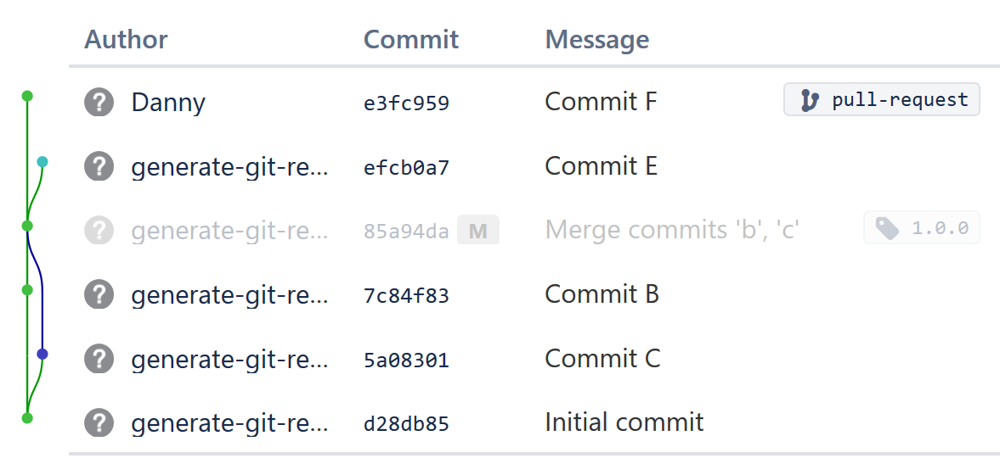

# generate-git-repo

**Generate Git repositories for testing purposes.**

If you have tooling/scripts that read and interact with Git repositories, you might want to test them against reproducible variations.

## Example

CLI:

```bash
cat ./example-input.json | generate-git-repo --bare ./path-to-new-repo
```

Result:



example-input.json:

```json
[
  { "type": "commit",   "id": "a", "message": "Initial commit" },
  { "type": "commit",   "id": "b", "message": "Commit B",      "parents": ["a"] },
  { "type": "commit",   "id": "c", "message": "Commit C",      "parents": ["a"] },
  { "type": "commit",   "id": "d", "message": "Merge B and C", "parents": ["b", "c"], "tags": ["1.0.0"] },
  { "type": "commit",   "id": "e", "message": "Commit E",      "parents": ["d"],      "branches": ["master"] },
  { "type": "commit",   "id": "f", "message": "Commit F",      "parents": ["d"] },
  { "type": "branch",   "name": "pull-request", "on": "f" }
]
```


## Write a program to generate the input, and pipe it into `generate-git-repo`

The motivation for using stdin is to allow other programs to generate the list of commands. This is the intended purpose of `generate-git-repo`.

Suppose you have a Node.js script `create-tree.js`. It declares a recursive tree.

```bash
node ./create-tree.js | generate-git-repo --bare ./crazy-tree-repo
```

Or if you'd rather save a compiled list of commands and feed that into the progrram, you can do that too.

## Command documentation

WORK IN PROGRESS

### `"type": "commit"`

Creates a commit.

Fields:

* `id` - Required. Commit identifier. This is NOT a Git commit hash, but rather a way for the generator to internally keep track of commits.
* `message` - Optional. Commit message. Can be a single line, or multiple lines. If not specified, the message is the commit identifier.
* `parents` - Optional. A list of parent commits. If not specified, creates an orphaned commit (i.e. for initial commits).
* `tree` - Optional. A recursive object. It specifies the files and directories that should be in the commit. If not specified, the commit uses the default set of files (none by default).
* `branches` - Optional. A list of branch names. All listed branch names will be set to this commit. Branches can also be created in the `"type": "branch"` command.
* `tags` - Optional. A list of tag names. All listed tag names will be set as lightweight tags to this commit. Tags can also be created in the `"type": "tag"` command.

For any `tree` string values, the encoding is UTF-8.

Example:
```json
{
  "type": "commit",
  "id": "4",
  "message": "Test",
  "parents": ["1", "2", "3"],
  
  "tree": {
    "hello.txt": "world",
    "directory": {
      "foo.txt": "bar",
      "fizz.txt": "buzz"
    }
  }
}
```

### `"type": "branch"`

Creates a branch at the reference. Branches can also be created in the `"type": "commit"` command.

Fields:

* `name` - Required. The name of the branch. e.g. master
* `on` - Required. Where to create the branch.

### `"type": "config"`

Applies miscellaneous configuration, such as author/commiter/tagger information.

Note: `all_` has low precedence. e.g. If `author_name` and `all_name` are both set, then `author_name` will apply to the author, and `all_name` will apply to the committer and tagger.

Author/committer/tagger fields:

* `all_name` - Optional. Sets the author, committer and tagger name.
* `all_email` - Optional. Sets the author, committer and tagger email.
* `author_name` - Optional. Sets the author name.
* `author_email` - Optional. Sets the author email.
* `committer_name` - Optional. Sets the committer name.
* `committer_email` - Optional. Sets the committer email.
* `tagger_name` - Optional. Sets the tagger name.
* `tagger_email` - Optional. Sets the tagger email.

Other fields:

* `tree` - Optional. A recursive object. Sets the default tree. (see `"type": "commit"` documentation)

# "FAQ"

## Couldn't I just run a bunch of git commands to generate a test repo?

Yes, you definitely could! But in my experience, this is quite tricky for repos with non-trivial commit graphs.

Creating commits with git commands in a linear fashion works well, but you hit a snag as soon as you have branches and merges.
If you want to create branching commits that hop across different commit parents, you could try `git checkout <HASH> && git commit ...` or `git commit-tree`, but you'd need to implement a lookup to remember the commit hashes. You could also tag/branch everything you need to go back to, as long as you delete them. Again, it's a lot of overhead work.

If you want to additionally populate each commit with different files, you'd also have to worry about the index (or resort to git plumbing commands like `git hash-object` and `git mktree`).

## Why Rust?

I wanted a program that's standalone, portable across platforms, and not bound to any language runtime. It should additionaly not require interfacing with the `git` command (based on my own benchmarks, using `git` plumbing commands can be up to 6x slower for large repos!).

The libgit2 bindings for Rust are quite solid, and it's used in popular projects like Cargo, Rust's package manager.

# Building

You'll need Rust and Cargo installed on your machine. The easiest way to do this is with rustup:
https://rustup.rs/

## Dependencies

Cargo will handle all dependencies automatically. If there are problems building `git2`, it might be because of a missing C compiler. One way to quickly resolve these type of build errors may be to install `gcc`, `clang` or similar. See also: https://crates.io/crates/cc

This project depends on `git2`: https://github.com/alexcrichton/git2-rs

## Running locally

The following will run a debug build.

```
cargo run -- <arguments go here>
```

## Installing locally

The following comamnd will build the release binary and place it in a location controlled by Cargo. If Cargo was installed via rustup, this location should be in your PATH.

```
cargo install --path .
```